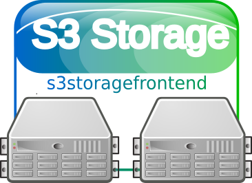

# s3storagefrontend

<!---
[](http://www.ted.com/talks/simon_sinek_how_great_leaders_inspire_action)
--->
[](https://GitHub.com/elbosso/s3storagefrontend/releases/)
[](https://GitHub.com/elbosso/s3storagefrontend/tags/)
[](https://github.com/elbosso/s3storagefrontend/blob/master/LICENSE)
[](https://GitHub.com/elbosso/s3storagefrontend/issues/)
[](https://GitHub.com/elbosso/s3storagefrontend/issues?q=is%3Aissue+is%3Aclosed)
[](https://github.com/elbosso/s3storagefrontend/issues)
[](https://GitHub.com/elbosso/s3storagefrontend/graphs/contributors/)
[](https://github.com/elbosso/s3storagefrontend)
[](https://elbosso.github.io/)



## Overview

This project offers a frontend to an s3 storage - storing files only for a short time. 
You can build it by issuing

```
mvn compile package
```

and then starting the resulting monolithic jar file by issuing

```
$JAVA_HOME/bin/java -jar target/s3storagefrontend-<version>-jar-with-dependencies.jar
```

Alternatively one could just start the server using maven by  issuing

```
mvn compile exec:java
```

In both cases, the server starts on port 7000 - at the moment
only POST requests are supported. POSTs must be of
mimetype `multipart/form-data`, the form must contain a file
named _data_ containing the contents of the file being uploaded - it 
is then answered with a key needed to retrieve the file again.

At the moment, this is a prototype. It still lacks support for TLS.

However the recommended mode of using this is to use the provided _Dockerfile_ 
and _docker-compose.yml_ file. It is probably better 
to actually use a proxy solution like traefik (the docker-compose is 
already prepared for this) or similar
solutions so the services are actually accessible with a sound hostname and 
some default port.

## Configuration

All configuration is done vie _environment.env_ - just copy and rename _environment.env_template_ 
and customize its contents. Monitoring is configured by copying _src/main/resources/influxdb_micrometer.proprerties_template_
to _src/main/resources/influxdb_micrometer.proprerties_ and customizing it.

## Where to get an S3 instance for playing?

You could use [Min.IO](https://github.com/minio/minio)
for your first steps -i even prepared a small `docker-compose.yml` as stasrrting point to host your own instance:

```
version: '3.1'

services:
  app:
    image: minio/minio
    env_file: ./minio.env
    volumes:
     - ./data:/data
    container_name: minio
    hostname: minio
    labels:
      - "traefik.enable=true"
      - "traefik.http.routers.minio.rule=Host(`minio.pi-docker.lab`)"
      - "traefik.http.services.minio.loadbalancer.server.port=9000"
      - "traefik.docker.network=pi_traefik_proxy"
    networks:
      - traefik_proxy
    command:  minio server /data

networks:
  traefik_proxy:
    external:
      name: pi_traefik_proxy
```

## Working with it

### Upload

Just issue a HTTP POST request as multipart form data
(for example from a file upload from inside a web page):
```shell script
curl -J -O -F "data=@<some_file>" http://<host>:<port>/upload
``` 

A HTTP status code of 201 signifies success. If the operation is successful, the response
contains the direct link fpr the download of the uploaded object in three different locations:
The URL of the uploaded file (to be used to access the file later on or to share it with others)
is contained in the `head` of the HTML page as a `link` element,
in the body of the HTML page as a hyperlink (`a`) element and as a `Content-Location` header in the response.

If the HTTP header `Accept` is sent with the request having a value of `text/plain`,
the service does only return the plain URL to the uploaded file for easier integration into scripts for example:</p>
```shell script
curl -J -O -H "Accept: text/plain" -F "data=@<some_file_name>" http://<host>:<port>/upload 
```

If the HTTP header `Accept` is sent with the request having a value of `application/json`,
the service does return a json document with helpful information - for example:</p>
```shell script
curl -J -O -H "Accept: application/json" -F "data=@<some_file_name>" http://<host>:<port>/upload 
```

would return something on the lines of:

```json
{
  "download": {
    "curl": "curl -O -J http://localhost:7000/download/1ecd4d93-d0bb-45e3-8aff-c9bc3662f0c9",
    "wget": "wget http://localhost:7000/download/1ecd4d93-d0bb-45e3-8aff-c9bc3662f0c9 --content-disposition",
    "href": "http://localhost:7000/download/1ecd4d93-d0bb-45e3-8aff-c9bc3662f0c9"
  },
  "delete": {
    "curl": "cirl -X DELETE http://localhost:7000/delete/1ecd4d93-d0bb-45e3-8aff-c9bc3662f0c9",
    "wget": "wget --method=DELETE http://localhost:7000/delete/1ecd4d93-d0bb-45e3-8aff-c9bc3662f0c9",
    "href": "http://localhost:7000/delete/1ecd4d93-d0bb-45e3-8aff-c9bc3662f0c9"
  },
  "uuid": "1ecd4d93-d0bb-45e3-8aff-c9bc3662f0c9"
}
```

### Retrieval

Once the user has a valid URL, accessing the file is as easy as</p>
```shell script
curl -O -J http://<host>:<port>/<url></div>
```
or alternatively using
`wget:`
```shell script
wget http://<host>:<port>/<url> --content-disposition
```

### Deletion

Deleting a file explicitly before the configured timespan is up is almost as easy:
All the user needs to do that is the UUID contained in the URL:
```shell script
curl -X DELETE http://<host>:<port>/delete/<uuid>
```

## Expiration of documents

At the moment the bucket given in _environment.env_ must exist. However it is not necessary to
configure any expiration times upon it - after starting the service, the bucket is configured accordingly.

## RFC 3161 Timestamps

It is possible to configure the system in a way that allows to fetch cryptographic timestamps
for the file contents - al the administrator has to do is to specify four configuration items.
If this is done, the solution offers an additional endpoint named `timestamp` that works
similarly to the `download` endpoint but does not return the files original content but
a timestamp according to [RFC 3161](https://tools.ietf.org/html/rfc3161), making it possible to prove that the archived document
existed in its current form at the time the timestamp was created. The four configuration items needed are:

* `de.elbosso.tools.s3storagefrontend.rest.App.rfc3161url` The Url the timestamping 
  service is available under - if not given, the timestamping service is not 
  available. This is the default.
* `de.elbosso.tools.s3storagefrontend.rest.App.tspolicyoid` The policy to use for 
  the timestamping request - if not given, 
  [0.4.0.2023.1.1](http://oid-info.com/get/0.4.0.2023.1.1) is used - 
  the default baseline policy
* `de.elbosso.tools.s3storagefrontend.rest.App.tscertreq` decides wether the reply from
  the timestamping service should include the certificate - the default here is `true`
* `de.elbosso.tools.s3storagefrontend.rest.App.binarybodyname` The timestamping service
  is queried using a `POST` request with a multipart form data - this configuration item
  specifies the key under which the timestamping query is registered in the form - the
  default here is `tsq`
  
It is for example possible to use the project 
[rfc3161timestampingserver](https://github.com/elbosso/rfc3161timestampingserver)
as timestamping service here.

## Attribution
The LICENSE holds for all material in this project except for _src/main/resources/site/s3storagefrontend_logo.png_ and _src/main/resources/site/s3storagefrontend_logo.svg_ - they are made available here under the [Creative Commons Attribution-Share Alike 3.0 Unported](https://creativecommons.org/licenses/by-sa/3.0/deed.en) license. They were derived from [File:Server-multiple.svg](https://en.wikipedia.org/wiki/File:Server-multiple.svg).
